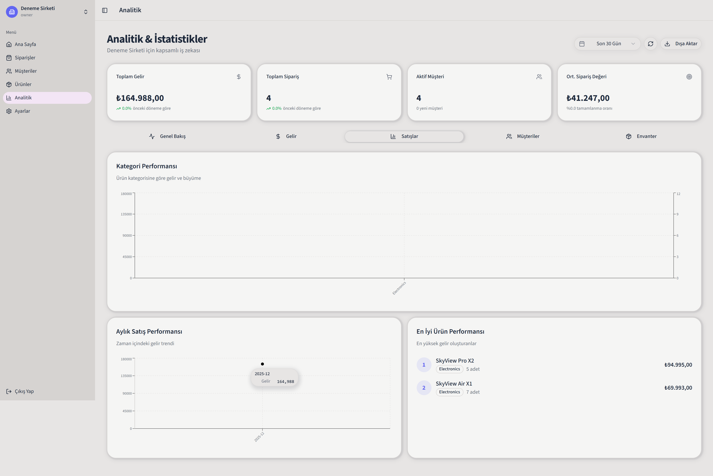
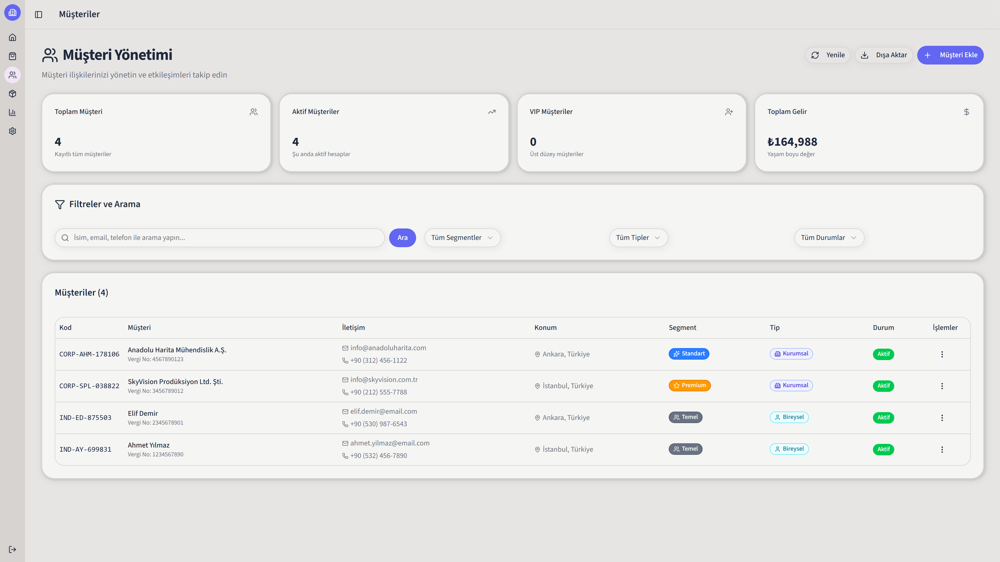
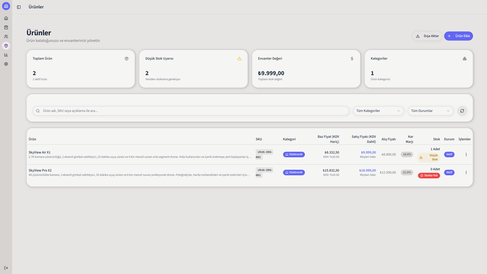
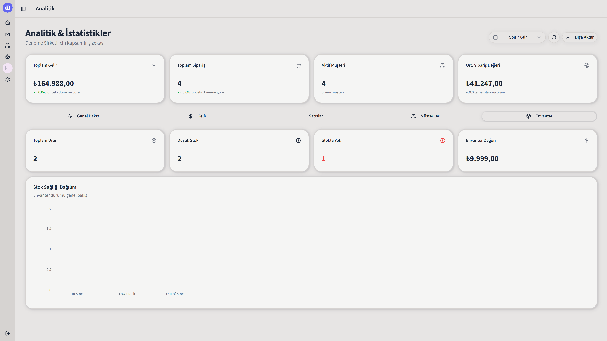

# Centura CRM

> Müşteri İlişkileri Yönetim Platformu - ERP Ekosisteminin Kalbi

Centura, kurumsal ERP sistemlerinin müşteri ilişkileri yönetimi (CRM) modülüdür. Müşteri yaşam döngüsünün tüm aşamalarını yönetirken, satış, iletişim, analitik ve envanter entegrasyonuyla güçlü bir iş çözümü sunar. Çok kiracılı SaaS mimarisine dayalı Centura, ölçeklenebilir ve güvenli bir müşteri yönetim deneyimi sağlar.

---

## 🎯 CRM Özellikleri

### 👥 Müşteri Yönetimi (Core CRM)

- **Müşteri Profilleri** - Tüm müşteri bilgilerini merkezi bir yerde tutun
- **İletişim Geçmişi** - Email, telefon ve notlar otomatik olarak takip edin
- **Satış Fırsat Yönetimi** - Pipeline'ınızı görselleştirin ve fırsat takibi yapın
- **Müşteri Segmentasyonu** - Müşteri davranışına göre otomatik kategorilendirme
- **Müşteri İstatistikleri** - Sipariş geçmişi, toplam harcama, son etkileşim

### 📊 Analitik & İçgörüler (CRM Analytics)

- **Gerçek zamanlı satış istatistikleri** - Günlük, aylık ve yıllık trend analizi
- **Müşteri davranış analizi** - En değerli müşterileri belirleyin
- **Satış performans raporları** - Konuya göre satış metrikleri
- **Envanter sağlığı takibi** - Stok seviyeleri ve yeniden sipariş uyarıları
- **Aylık büyüme metrikleri** - MoM (Aylık) değişim oranları

### 🛒 Satış Yönetimi (ERP Entegrasyonu)

- **Sipariş Yönetimi** - CRM'den doğrudan sipariş oluşturun ve takip edin
- **Dinamik Ürün Kataloğu** - Müşteri segmentine göre ürün önerileri
- **Satış Döngüsü Otomasyonu** - Lead'den müşteriye dönüşüm pipeline'ı
- **Ödeme ve Kargo Takibi** - Sipariş fulfillment otomasyonu

### 📦 Envanter Entegrasyonu (ERP Modülü)

- **Stok Düzeylerinin İzlenmesi** - Müşteri siparişleriyle senkronize stok
- **Düşük Stok Uyarıları** - Otomatik yeniden sipariş tetikleyicileri
- **Ürün Kategorilendirmesi** - Müşteri segmentasyonuyla ilişkili kategoriler
- **Tedarikçi Yönetimi** - Satın alma ve tedarikçi entegrasyonu

### 🔐 Güvenlik & Uyum

- Rol tabanlı erişim kontrolü (RBAC)
- Şifreli veri depolama
- Oturum yönetimi
- Denetim günlükleri

---

## 📸 Ekran Görüntüleri

### Dashboard


_Ana kontrol paneli - toplam satışlar, müşteri sayısı ve önemli metrikleri bir bakışta görün_

### Satış Analitikleri


_Detaylı satış grafikleri, trend çizgileri ve tarih bazlı filtreleme_

### Müşteri Yönetimi


_Müşteri listesi, arama ve detaylı müşteri profilleri_

### Envanter & Ürün Yönetimi


_Ürün kataloğu, stok durumu ve kategori yönetimi_

### Raporlar & İçgörüler


_Detaylı raporlar, analiz grafikleri ve dışa aktarma seçenekleri_

---

## 🚀 Hızlı Başlangıç

### Gereksinimler

- **Docker & Docker Compose** (Önerilen - tüm bağımlılıkları otomatik yönetir)
- Node.js 20+ (Manuel kurulum için)
- PostgreSQL 16+ (Manuel kurulum için)

### Installation & Setup

#### 🐳 Docker ile (Önerilen & Tavsiye Edilen)

**1. Ortam Dosyasını Hazırlayın**

```bash
# Repository'yi klonlayın
git clone https://github.com/REDLANTERNDEV/centura.git
cd centura

# Ortam değişkenlerini .env.docker.example'den kopyalayın
cp .env.docker.example .env
```

Ardından `.env` dosyasında şunları kontrol edin:

- `DB_PASSWORD` - Veritabanı şifresi (güvenli bir şifre kullanın)
- `JWT_SECRET` - En az 32 karakter (güvenli bir key oluşturun)
- `SESSION_SECRET` - En az 32 karakter
- `NODE_ENV` - "development" veya "production"

**2. Geliştirme Ortamında Çalıştırın**

```bash
# İlk Kurulum (bağımlılıkları yükler ve konteynerleri oluşturur)
docker-compose -f docker-compose.yml -f docker-compose.dev.yml up --build

# Sonraki Çalıştırmalar (varolan görüntüleri kullanır)
docker-compose -f docker-compose.yml -f docker-compose.dev.yml up
```

**3. Uygulamaya Erişin**

| Hizmet         | URL                                 | Port |
| -------------- | ----------------------------------- | ---- |
| Frontend (Dev) | http://localhost:4321               | 4321 |
| Backend API    | http://localhost:8765/api/v1        | 8765 |
| Health Check   | http://localhost:8765/api/v1/health | 8765 |
| PostgreSQL     | localhost:5432                      | 5432 |

**4. Opsiyonel - Veritabanını İşletme**

```bash
# Prisma Studio (Veritabanını GUI ile görüntüleyin)
docker-compose -f docker-compose.yml -f docker-compose.dev.yml exec backend npx prisma studio

# Veritabanını Sıfırla (tüm veri silinir)
docker-compose -f docker-compose.yml -f docker-compose.dev.yml down -v
```

---

#### 🚀 Üretim Ortamında Deployment

```bash
# Üretim görüntülerini oluşturun ve başlatın
docker-compose -f docker-compose.yml -f docker-compose.prod.yml up -d

# Durumu kontrol edin
docker-compose -f docker-compose.yml -f docker-compose.prod.yml ps
```

---

#### 💻 Manuel Kurulum (Docker Olmadan)

```bash
# Repository'yi klonlayın
git clone https://github.com/REDLANTERNDEV/centura.git
cd centura

# Ortam değişkenlerini ayarlayın
cp .env.example .env

# Tüm bağımlılıkları yükleyin (root workspace)
npm install

# Backend başlatın (Terminal 1)
cd apps/backend
npm run dev
# Backend çalışıyor: http://localhost:8765

# Frontend başlatın (Terminal 2)
cd apps/frontend
npm run dev
# Frontend çalışıyor: http://localhost:3000
```

### 🔧 Genel Docker Komutları

```bash
# Tüm container'ları başlat
docker-compose -f docker-compose.yml -f docker-compose.dev.yml up -d

# Tüm container'ları durdur
docker-compose -f docker-compose.yml -f docker-compose.dev.yml down

# Logları görüntüle
docker-compose -f docker-compose.yml -f docker-compose.dev.yml logs -f

# Belirli servisi restart et
docker-compose -f docker-compose.yml -f docker-compose.dev.yml restart backend

# Container'a bash erişimi
docker-compose -f docker-compose.yml -f docker-compose.dev.yml exec backend sh

# Veritabanını temizle (uyarı: tüm veri silinir)
docker-compose -f docker-compose.yml -f docker-compose.dev.yml down -v
```

---

## 📋 Proje Yapısı

```
centura/
├── 📱 apps/
│   ├── backend/
│   │   ├── src/
│   │   │   ├── config/        # Yapılandırma dosyaları
│   │   │   ├── controllers/   # İstek işleyicileri
│   │   │   ├── middleware/    # Kimlik doğrulama, güvenlik
│   │   │   ├── models/        # Veritabanı şemaları
│   │   │   ├── routes/        # API uç noktaları
│   │   │   ├── services/      # İş mantığı
│   │   │   └── validators/    # Girdi doğrulaması
│   │   ├── Dockerfile
│   │   └── package.json
│   │
│   └── frontend/
│       ├── app/               # Next.js uygulama
│       ├── components/        # React bileşenleri
│       ├── hooks/            # Özel React hook'ları
│       ├── lib/              # Yardımcı fonksiyonlar
│       ├── public/           # Statik dosyalar
│       ├── Dockerfile
│       └── package.json
│
├── 🐘 docs/
│   ├── docker/              # Docker yapılandırması
|   ├── guides/              # Projedeki bazı modüllerin yapısı
│
├── 🔧 scripts/
│   ├── docker-setup.sh      # Docker otomasyonu
│   └── backup-db.sh         # Veritabanı yedeklemesi
│
├── docker-compose.yml       # Üretim yapılandırması
├── docker-compose.dev.yml   # Geliştirme yapılandırması
└── package.json            # Workspace tanımı
```

---

## 🛠️ Teknoloji Stack'i

### Frontend

- **Next.js 16** - React SSR & Static Generation Framework
- **React 19** - UI Library
- **TypeScript** - Type-safe development
- **Tailwind CSS 4** - Utility-first CSS framework
- **Recharts** - Charts & visualizations
- **Radix UI** - Accessible component library
- **Axios** - HTTP client for API calls
- **Zod** - Runtime type validation

### Backend

- **Express.js 5** - Minimal web framework
- **Node.js 20** - JavaScript runtime
- **PostgreSQL 16** - Relational database
- **JWT** - Stateless authentication
- **Argon2** - Password hashing
- **node-cron** - Scheduled tasks (token cleanup)

### DevOps & Infrastructure

- **Docker** - Container runtime
- **Docker Compose** - Multi-container orchestration
- **Nginx** - Reverse proxy (optional, production)
- **Prisma** - ORM (planned for future use)

### Development Tools

- **ESLint** - Code linting
- **Nodemon** - Auto-reload for backend
- **Turbopack** - Next.js dev compiler (fast builds)

---

## 🔐 Güvenlik Özellikleri

✅ **Kimlik Doğrulama**

- JWT tabanlı token yönetimi
- Güvenli oturum yönetimi
- Çıkış fonksiyonu ve token geçersiz kılması

✅ **Yetkilendirme**

- Rol tabanlı erişim kontrolü (Admin, Yönetici, Kullanıcı)
- Kaynak seviyesi izinleri

✅ **Veri Koruma**

- Argon2 ile parola şifreleme
- HTTPS/TLS desteği
- CORS güvenliği
- Rate limiting

✅ **Denetim**

- İşlem günlükleri
- Kullanıcı aktivite izleme
- Değişiklik geçmişi

---

## 📊 Veritabanı Şeması (CRM + ERP)

### CRM Core Tables

- **users** - Kullanıcı hesapları ve profiller
- **organizations** - İşletme verileri ve tenant bilgisi
- **customers** - Müşteri profilleri ve iletişim bilgileri
- **customer_interactions** - Email, telefon, not ve etkinlik geçmişi
- **sales_opportunities** - Satış fırsatları ve pipeline durumu

### ERP Integration Tables

- **orders** - Satış siparişleri (müşterilerden)
- **order_items** - Sipariş detayları ve ürün bilgileri
- **products** - Ürün kataloğu ve özellikleri
- **categories** - Ürün kategorilendirmesi
- **inventory** - Stok düzeyleri ve yönetimi
- **suppliers** - Tedarikçi bilgileri

### Analytics Tables

- **sales_analytics** - Agregat satış verileri
- **customer_analytics** - Müşteri davranış ve segment analizi
- **audit_logs** - İşlem ve erişim denetim günlükleri

---

## 🏗️ Mimari - CRM + ERP Entegrasyonu

Centura, kurumsal ERP sistemleriyle sorunsuz entegrasyon için tasarlanmıştır:

```
┌─────────────────────────────────────────┐
│         Centura CRM (Frontend)          │
│   Müşteri Yönetimi & Satış Pipeline     │
└────────────────┬────────────────────────┘
                 │
        ┌────────┴────────┐
        │                 │
   ┌────▼──────┐    ┌─────▼─────┐
   │  API Gateway   │ Auth Service│
   └────┬──────┘    └─────┬─────┘
        │                 │
   ┌────▼──────────────────▼──────┐
   │   Express Backend Services    │
   ├──────────────────────────────┤
   │  CRM Svc  │ Sales Svc │ Auth │
   └────┬──────────────────┬──────┘
        │                  │
   ┌────▼──────────────────▼──────┐
   │    PostgreSQL Database        │
   ├──────────────────────────────┤
   │ Customers │ Orders │ Products│
   │ Analytics │ Users  │ Logs    │
   └──────────────────────────────┘
```

**ERP Modülleri:**

- ✅ CRM (Müşteri Yönetimi) - Ana Modül
- ✅ Sales (Satış Yönetimi) - Order Management
- ✅ Inventory (Envanter) - Stock Management

---

## 🚀 Deployment

### Development

```bash
docker-compose -f docker-compose.yml -f docker-compose.dev.yml up
```

### Production

```bash
docker-compose -f docker-compose.yml -f docker-compose.prod.yml up -d
```

---

## 📝 Lisans

Bu proje **GNU Affero General Public License v3 (AGPL-3.0)** altında lisanslanmıştır. Detaylar için [LICENSE](./LICENSE) dosyasını görün.

**AGPL-3.0 Özet:**

- ✅ Özgür kullanım, değiştirme ve dağıtma
- ✅ Ticari kullanım mümkün
- ⚠️ Değişiklikler açık kaynak olmalı
- ⚠️ Ağ üzerinden sunulan değiştirilmiş sürümler açıklanmalı

---

## 👥 Hakkında

**Centura CRM**, modern işletmeler için açık kaynak kodlu bir CRM çözümüdür ve kurumsal ERP ekosisteminin temel bileşenidir. Esneklik, güvenlik ve müşteri odaklılığı göz önünde tutularak tasarlanmıştır.

---

### 📚 Daha Fazla Bilgi

- [API Referansı](./api-tests/README.md)

---

## 🤝 Katkıda Bulunma

Centura CRM'e katkıda bulunmak ister misiniz? Harika!

1. Repo'yu fork edin
2. Feature branch oluşturun (`git checkout -b feature/harika-ozellik`)
3. Değişiklikleri commit edin (`git commit -m 'feat: harika özellik eklendi'`)
4. Branch'i push edin (`git push origin feature/harika-ozellik`)
5. Pull Request açın

Detaylı bilgi için [Katkıda Bulunma Rehberi](.github/CONTRIBUTING.md)'ni okuyun.

### Hata Bildirimi & Özellik İsteği

- 🐛 **Hata bildirmek için:** [Issue açın](https://github.com/REDLANTERNDEV/centura/issues/new)
- 💡 **Özellik önermek için:** "feature request" etiketi ile [Issue açın](https://github.com/REDLANTERNDEV/centura/issues/new)

---
