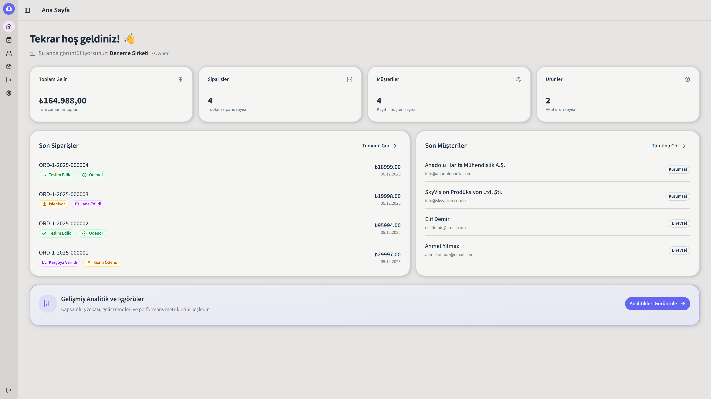
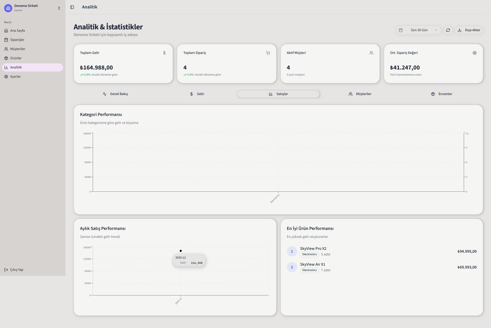
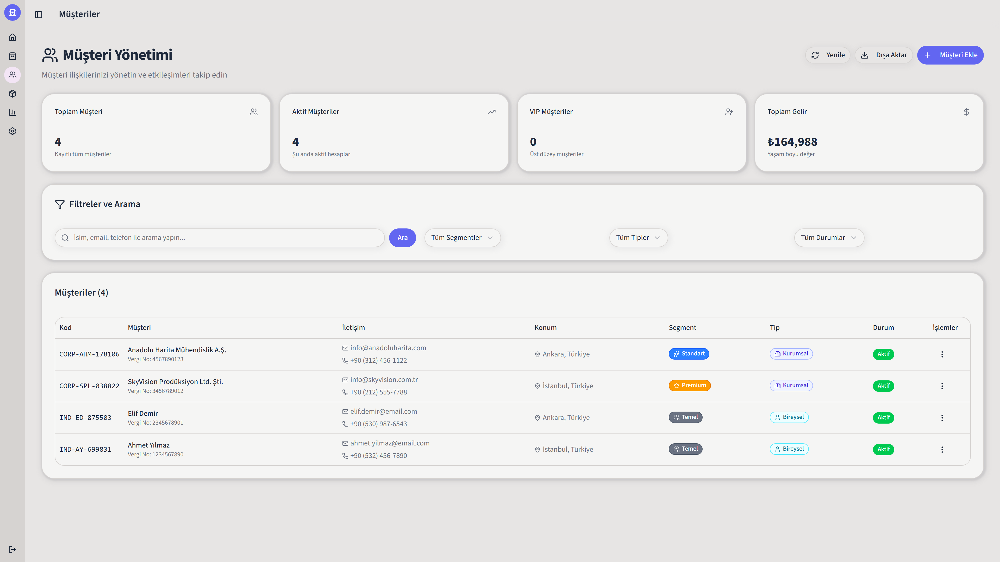
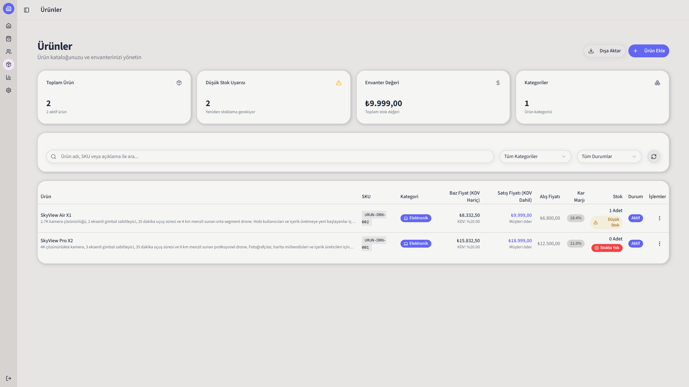

# Centura

Self-hostable, multi-tenant CRM for small and mid-sized businesses. Manage customers, orders, product stock and sales analytics from a single application.

[](./LICENSE)

**Türkçe:** [README.tr.md](./README.tr.md)

---

## Screenshots

| Dashboard                                         | Sales analytics                                               |
| ------------------------------------------------- | ------------------------------------------------------------- |
|  |  |

| Customers                                         | Products & stock                                 |
| ------------------------------------------------- | ------------------------------------------------ |
|  |  |

---

## Features

### Customers

Customer records with contact details, billing and shipping addresses, tax number
and tax office, segment and customer type, credit limit, payment terms, an assigned
account owner, and free-form notes.

### Orders

Full order lifecycle — `draft` → `confirmed` → `processing` → `shipped` →
`delivered`, with `cancelled` available at any point. Each order carries line items,
per-order and per-line discounts, tax, subtotal and total, separate shipping and
billing addresses, and an expected delivery date. Payment is tracked independently
as `pending`, `partial`, `paid` or `refunded`.

### Products and stock

Product catalogue with SKU, barcode, category, unit, and three price fields (base,
sale, cost) plus a tax rate. Stock is tracked per product with a low-stock threshold
and a reorder point.

### Analytics

A dedicated insights API with 17 endpoints, surfaced through the dashboard and the
analytics page:

- **Customers** — top customers, segments, retention, churn, and RFM
  segmentation (recency / frequency / monetary)
- **Revenue** — revenue metrics, gross margin, month-over-month growth
- **Payments** — payment analysis and days sales outstanding (DSO)
- **Orders and products** — order metrics, top-selling products, category
  performance, monthly sales
- **Inventory** — stock health and turnover

### Multi-tenancy

Every record is scoped to an organisation. Users are linked to organisations through
`user_organization_roles`, which supports five roles:

| Role        | Intended use                                                               |
| ----------- | -------------------------------------------------------------------------- |
| `org_owner` | Full control of the organisation, including billing and ownership transfer |
| `org_admin` | Administrative access; manages users and settings                          |
| `manager`   | Day-to-day management of customers, orders and products                    |
| `user`      | Standard operational access                                                |
| `viewer`    | Read-only                                                                  |

A separate `platform_admin` system role exists for operators of the deployment
itself. Platform admins cannot silently read tenant data — access goes through
`support_access_requests`, an approval workflow with `pending` / `approved` /
`rejected` / `expired` states.

### Auditing

Actions are written to `audit_logs` for later review.

---

## Tech stack

**Frontend** — Next.js 16 (App Router, Turbopack), React 19, TypeScript,
Tailwind CSS 4, Radix UI, Recharts, Axios, Zod.

**Backend** — Node.js 20, Express 5, PostgreSQL 16 accessed directly via `pg`
(no ORM), JWT authentication, Argon2 password hashing, Helmet,
`express-rate-limit`, `node-cron` for scheduled refresh-token cleanup.

**Infrastructure** — Docker and Docker Compose, npm workspaces, optional nginx
reverse proxy, ESLint and Prettier with Husky and lint-staged.

---

## Quick start

Requirements: Docker and Docker Compose. (For a non-Docker setup you need Node.js 20+
and PostgreSQL 16+.)

```bash
git clone https://github.com/REDLANTERNDEV/centura.git
cd centura
cp .env.docker.example .env
```

Set at least these values in `.env` before starting:

| Variable         | Notes                                          |
| ---------------- | ---------------------------------------------- |
| `DB_PASSWORD`    | Database password. Change it from the default. |
| `JWT_SECRET`     | 32+ random characters                          |
| `SESSION_SECRET` | 32+ random characters                          |

Generate a secret with:

```bash
openssl rand -base64 48
```

Then start the development stack:

```bash
docker-compose -f docker-compose.yml -f docker-compose.dev.yml up --build
```

| Service      | URL                                 |
| ------------ | ----------------------------------- |
| Frontend     | http://localhost:4321               |
| Backend API  | http://localhost:8765/api/v1        |
| Health check | http://localhost:8765/api/v1/health |
| PostgreSQL   | localhost:5432                      |

The database schema is applied automatically on first start from
`apps/backend/scripts/init-schema.sql`.

### Common commands

```bash
# Start in the background
docker-compose -f docker-compose.yml -f docker-compose.dev.yml up -d

# Follow logs
docker-compose -f docker-compose.yml -f docker-compose.dev.yml logs -f

# Restart one service
docker-compose -f docker-compose.yml -f docker-compose.dev.yml restart backend

# Shell into a container
docker-compose -f docker-compose.yml -f docker-compose.dev.yml exec backend sh

# Stop and delete all data, including the database volume
docker-compose -f docker-compose.yml -f docker-compose.dev.yml down -v
```

### Without Docker

```bash
cp .env.example .env
npm ci

# Terminal 1 — backend on http://localhost:8765
npm run dev:backend

# Terminal 2 — frontend on http://localhost:3000
npm run dev:frontend
```

You will need a PostgreSQL 16 instance reachable at the `DB_*` values in `.env`,
with `apps/backend/scripts/init-schema.sql` applied.

---

## Deployment

### Required configuration

```bash
NEXT_PUBLIC_API_URL=https://yourdomain.com/api/v1   # URL the browser calls
CORS_ORIGIN=https://yourdomain.com
JWT_SECRET=<random 32+ characters>
SESSION_SECRET=<random 32+ characters>
```

> **`NEXT_PUBLIC_API_URL` is compiled into the JavaScript bundle at build time.**
> Changing it requires a rebuild with `--build`; restarting the container is not
> enough. When using `docker-compose.prod.yml`, the build fails deliberately if this
> variable is unset, rather than shipping a bundle that points at `localhost`.

### Behind your own reverse proxy

If you already terminate TLS with Traefik, Caddy, Cloudflare, nginx, or a platform
such as Dokploy or Coolify, you do not need the bundled nginx. Point your proxy at
the frontend and backend containers:

```bash
docker-compose -f docker-compose.yml -f docker-compose.prod.yml up -d --build
```

### With the bundled nginx

The nginx service belongs to the `production` profile and **will not start** unless
that profile is enabled:

```bash
docker-compose -f docker-compose.yml -f docker-compose.prod.yml --profile production up -d --build
```

It serves everything from a single origin on port 80 — `/` to the frontend and
`/api/...` to the backend — so set `NEXT_PUBLIC_API_URL=http://your-host/api/v1`.

HTTPS is opt-in. To terminate TLS in this nginx instead of an upstream proxy, follow
the instructions in [`nginx/conf.d/tls.conf.example`](./nginx/conf.d/tls.conf.example).

### Ports

`BACKEND_PORT` and `FRONTEND_PORT` select the **host** port only. Inside the network,
the backend always listens on 8765 and the frontend on 4321, so the nginx upstreams
stay valid no matter how you map them.

PostgreSQL is deliberately **not** published to the host in production — the backend
reaches it over the internal Docker network. The development overlay publishes 5432
for local tooling. To reach a production database, use an SSH tunnel:

```bash
ssh -L 5432:localhost:5432 user@your-server
```

---

## Project structure

```
centura/
├── apps/
│   ├── backend/
│   │   ├── src/
│   │   │   ├── config/        # Database, cookies, messages
│   │   │   ├── controllers/   # Request handlers
│   │   │   ├── middleware/    # Auth, security, org context, errors
│   │   │   ├── models/        # SQL queries per domain
│   │   │   ├── routes/        # API endpoints
│   │   │   ├── services/      # Scheduled jobs
│   │   │   ├── utils/         # Audit logging and helpers
│   │   │   └── validators/    # Input validation
│   │   ├── scripts/           # init-schema.sql and maintenance SQL
│   │   └── Dockerfile
│   └── frontend/
│       ├── app/               # Next.js App Router pages
│       ├── components/        # React components
│       ├── hooks/             # Custom hooks
│       ├── lib/               # API client and helpers
│       └── Dockerfile
├── api-tests/                 # Bruno API collection
├── docs/                      # Docker guides and screenshots
├── nginx/                     # Reverse proxy configuration
├── scripts/                   # Setup and backup helpers
├── docker-compose.yml         # Base stack
├── docker-compose.dev.yml     # Development overlay
└── docker-compose.prod.yml    # Production overlay
```

---

## Database schema

Defined in [`apps/backend/scripts/init-schema.sql`](./apps/backend/scripts/init-schema.sql).

| Table                     | Purpose                                            |
| ------------------------- | -------------------------------------------------- |
| `organizations`           | Tenants                                            |
| `users`                   | User accounts                                      |
| `user_organization_roles` | Membership and role per organisation               |
| `platform_admins`         | Operators of the deployment                        |
| `support_access_requests` | Approval workflow for platform-admin tenant access |
| `refresh_tokens`          | Issued refresh tokens, cleaned up on a schedule    |
| `customers`               | Customer records                                   |
| `products`                | Catalogue, pricing and stock levels                |
| `orders`                  | Order headers, status, payment and addresses       |
| `order_items`             | Order line items                                   |
| `audit_logs`              | Recorded actions                                   |

---

## Security

**Authentication** — JWT access and refresh tokens delivered as cookies, with
`secure` enabled when `NODE_ENV=production`, `sameSite` set per cookie, and
`httpOnly` on session cookies. Passwords are hashed with Argon2.

**Refresh token rotation** — refresh tokens are stored hashed, never in plain text,
and grouped into _token families_. Each login starts a new family, so signing in on a
second device does not disturb the first. Refreshing rotates the token within its own
family and revokes the previous one, which means a single session can be invalidated
without logging the user out everywhere. Each token records the device it was issued
to and its last use, and expired rows are cleared on a `node-cron` schedule.

**CSRF** — state-changing requests are protected with a double-submit cookie: a
random token is issued alongside the session and deliberately left readable by
JavaScript so the client can echo it back in a header.

**Authorisation** — Five organisation roles plus a separate platform-admin role.
Tenant data is scoped by `org_id` and enforced by org-context middleware.

**Transport and headers** — Helmet security headers, a CORS allowlist driven by
`CORS_ORIGIN`, and rate limiting applied separately to authentication, verification,
sensitive operations, health checks and general traffic.

**Supply chain** — `.npmrc` enforces:

- `min-release-age=7` — packages published in the last 7 days are refused, limiting
  exposure to compromised releases
- `ignore-scripts=true` — install scripts such as `postinstall` do not run
- `save-exact=true` — dependencies are pinned to exact versions

Builds use `npm ci` so the lockfile is authoritative.

**Reporting a vulnerability** — please open a
[security advisory](https://github.com/REDLANTERNDEV/centura/security/advisories/new)
rather than a public issue.

---

## Not yet implemented

These are not in the current schema or API. They are listed so the scope is clear:

- Sales pipeline and opportunity tracking
- Customer interaction history (calls, emails, meeting logs)
- Supplier and purchasing management
- Automated reorder triggers from the low-stock threshold
- **User-facing session management.** The data layer is complete — active sessions
  are recorded per device and `getUserActiveSessions` / `revokeUserSession` are
  implemented in `userModel.js` — but no route exposes them yet, so users cannot
  currently list or revoke their own sessions. Wiring this up is a small,
  self-contained contribution.

---

## Known issues

Found while writing this documentation and verified against the code, not
yet fixed:

- **Analytics dashboard silently shows fake data on any API failure.** In
  `analytics/page.tsx`, a failed request falls back to mock data and clears
  the error state, with no environment gate despite a comment saying
  "for development." A user can see a fully-populated dashboard built from
  fabricated numbers with no indication it isn't real. See
  [analytics.md](./docs/guides/analytics.md#kozmetik-olmayan-iki-gerçek-hata).
- **The analytics time period selector has no effect.** The frontend sends a
  `period` query parameter the backend never reads. Same doc as above.
- **Order creation produces `NaN` totals if `unit_price` is omitted**, rather
  than falling back to the product's stored price as earlier docs claimed.
  See [orders.md](./apps/backend/docs/api/orders.md#bilinen-sorun-unit_price-boş-bırakılırsa-fiyat-otomatik-doldurulmaz).
- **CSRF tokens are generated but never verified.** `validateCSRFToken`
  exists but isn't wired into any route, and the frontend doesn't send the
  header. The only real CSRF protection is `sameSite: 'lax'`. See
  [http-only-cookies.md](./apps/backend/docs/architecture/http-only-cookies.md#bilinen-sorun-csrf-tokenı-üretiliyor-ama-hiçbir-yerde-doğrulanmıyor).
- **Request-scoped debug logging runs unconditionally in every environment**,
  including production — user emails, roles, and org IDs go to container
  logs on most authenticated requests. See
  [security.md](./apps/backend/docs/architecture/security.md#bilinen-sorun-hata-ayıklama-logları).
- **`make install` is broken on macOS/Linux** — Windows batch syntax in a
  POSIX Makefile target. Use `cp .env.docker.example .env` directly. See
  [docs/docker/README.md](./docs/docker/README.md).
- **`DB_NAME` defaults disagree across files** (`mini_saas_erp` vs.
  `centura_crm`), which also breaks the Makefile's `db-backup`/`db-restore`
  targets if you're on the other default. See
  [database.md](./apps/backend/docs/architecture/database.md#veritabanı-adı).

Two more were found and already fixed in the code during this pass: the
`calculate_rfm_scores` database function was missing entirely (RFM endpoint
would 500), and refresh-token validation scanned every user's tokens instead
of the requesting user's, both breaking and slowing down under load. Existing
production databases still need the RFM function applied manually — see
[insights.md](./apps/backend/docs/api/insights.md#bilinen-sorun-çözüldü--sunucunuzda-henüz-uygulanmamış-olabilir).

---

## Contributing

Contributions are welcome. See [CONTRIBUTING.md](./.github/CONTRIBUTING.md) for the
full guide.

```bash
git checkout -b feature/your-feature
npm run lint
npm run format
git commit -m "feat: describe your change"
```

Open a pull request against `main`. Commit messages follow
[Conventional Commits](https://www.conventionalcommits.org/).

- **Bugs:** [open an issue](https://github.com/REDLANTERNDEV/centura/issues/new)
- **Features:** open an issue labelled `feature request`

---

## Documentation

- [API reference](./api-tests/README.md)
- [Docker guide](./docs/docker/README.md)
- [Production checklist](./docs/docker/PRODUCTION_CHECKLIST.md)

---

## License

Licensed under the [GNU Affero General Public License v3.0](./LICENSE).

You may use, modify and distribute this software, including commercially. If you
modify it and make it available over a network, you must publish your modified
source under the same license.
